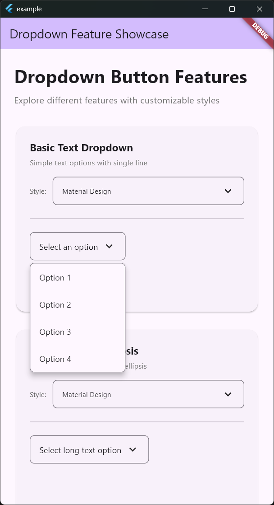
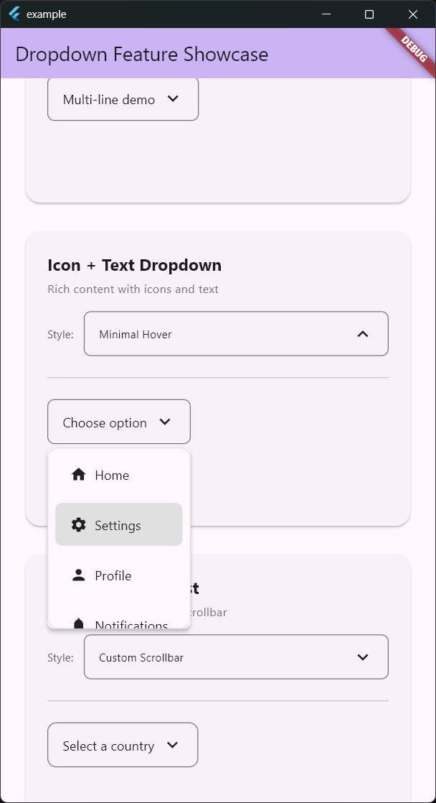

# Flutter Dropdown Button

A highly customizable dropdown package for Flutter with overlay-based rendering, smooth animations, and specialized variants for different content types.

[](https://pub.dev/packages/flutter_dropdown_button)
[](https://opensource.org/licenses/MIT)

## Features

- 🎨 **Highly Customizable**: Complete control over appearance and behavior
- 📱 **Overlay-based Rendering**: Better positioning and visual effects
- ✨ **Smooth Animations**: Scale and fade effects with configurable timing
- 🎯 **Outside-tap Dismissal**: Automatic closure when tapping outside
- 📏 **Dynamic Width**: Fixed, min/max width constraints, or content-based sizing
- 📐 **Independent Menu Width**: Set menu width separately from button with min/max constraints and alignment control
- 📝 **Text Overflow Control**: Ellipsis, fade, clip, or visible overflow options
- 🎭 **Multiple Variants**: Generic BasicDropdownButton and specialized TextOnlyDropdownButton
- 🎨 **Shared Theme System**: Consistent styling across all dropdown variants
- 📜 **Custom Scrollbar**: Scrollbar theming with colors, thickness, and visibility options
- ♿ **Accessibility Support**: Screen reader friendly with proper semantics

## Screenshots

<table>
  <tr>
    <td></td>
    <td></td>
  </tr>
  <tr>
    <td align="center"><b>Basic Text Dropdown</b><br/>Simple text options with customizable styles</td>
    <td align="center"><b>Icon + Text Dropdown</b><br/>Rich content with icons and hover effects</td>
  </tr>
</table>

## Variants

### BasicDropdownButton
Generic dropdown supporting any widget as items with complete customization.

### TextOnlyDropdownButton
Specialized dropdown for text content with precise text rendering control.

## Quick Start

Add to your `pubspec.yaml`:

```yaml
dependencies:
  flutter_dropdown_button: ^1.5.4
```

Import the package:

```dart
import 'package:flutter_dropdown_button/flutter_dropdown_button.dart';
```

## Basic Usage

### BasicDropdownButton

```dart
BasicDropdownButton<String>(
  items: [
    DropdownItem(
      value: 'apple',
      child: Row(
        children: [
          Icon(Icons.apple),
          SizedBox(width: 8),
          Text('Apple'),
        ],
      ),
    ),
    DropdownItem(
      value: 'banana',
      child: Text('Banana'),
    ),
  ],
  value: selectedValue,
  hint: Text('Select a fruit'),
  onChanged: (value) {
    setState(() {
      selectedValue = value;
    });
  },
)
```

### TextOnlyDropdownButton

```dart
TextOnlyDropdownButton(
  items: [
    'Short',
    'Medium length text',
    'Very long text that demonstrates overflow behavior',
  ],
  value: selectedText,
  hint: 'Select an option',
  maxWidth: 200,
  config: TextDropdownConfig(
    overflow: TextOverflow.ellipsis,
    maxLines: 1,
  ),
  onChanged: (value) {
    setState(() {
      selectedText = value;
    });
  },
)
```

## Advanced Features

### Custom Theme

```dart
TextOnlyDropdownButton(
  // ... other properties
  theme: DropdownStyleTheme(
    dropdown: DropdownTheme(
      borderRadius: 12.0,
      elevation: 4.0,
    ),
    scroll: DropdownScrollTheme(
      thickness: 8.0,
      thumbColor: Colors.blue,
      // Enable scroll gradient indicators
      showScrollGradient: true,
      gradientHeight: 20.0,
      gradientColors: [
        Colors.white,
        Colors.white.withOpacity(0.5),
        Colors.white.withOpacity(0.0),
      ],
    ),
  ),
)
```

### Text Configuration

```dart
TextOnlyDropdownButton(
  // ... other properties
  config: TextDropdownConfig(
    overflow: TextOverflow.fade,
    maxLines: 2,
    textStyle: TextStyle(fontSize: 16),
    textAlign: TextAlign.center,
  ),
)
```

### Dynamic Width

```dart
BasicDropdownButton<String>(
  // ... other properties
  maxWidth: 300,        // Maximum width constraint
  minWidth: 150,        // Minimum width constraint
  // OR
  width: 250,           // Fixed width
)
```

### Menu Width & Alignment

```dart
TextOnlyDropdownButton(
  // ... other properties
  width: 120,              // Button width
  minMenuWidth: 250,       // Menu minimum width (wider than button)
  maxMenuWidth: 400,       // Menu maximum width
  menuAlignment: MenuAlignment.left,  // left (default), center, or right
)
```

### Scroll Gradient Indicators

Show fade gradients at the edges when content is scrollable:

```dart
TextOnlyDropdownButton(
  items: longItemList,
  height: 200,  // Constrain height to enable scrolling
  theme: DropdownStyleTheme(
    scroll: DropdownScrollTheme(
      showScrollGradient: true,        // Enable gradient indicators
      gradientHeight: 24.0,            // Height of gradient effect
      gradientColors: [                // Custom gradient colors (optional)
        Colors.white,                  // Opaque at edge
        Colors.white.withOpacity(0.5), // Semi-transparent
        Colors.white.withOpacity(0.0), // Fully transparent
      ],
    ),
  ),
)
```

The gradient automatically appears at the top when you can scroll up and at the bottom when you can scroll down.

### Manual Dropdown Cleanup

Need to close any open dropdown before navigation or other actions? Use the static `closeAll()` method:

```dart
// Close dropdown before navigation
void navigateToHome() {
  DropdownMixin.closeAll();  // Immediately close any open dropdown
  Navigator.pushNamedAndRemoveUntil(
    context,
    '/home',
    (route) => false,
  );
}

// Close dropdown before showing dialog
void showDialog() {
  DropdownMixin.closeAll();
  showDialog(...);
}
```

**Note**: Dropdowns are automatically cleaned up during normal navigation (widget disposal). Use `closeAll()` only when you need explicit control over when the dropdown closes.

## Documentation

For detailed documentation and advanced usage examples, see:

- [Complete API Reference](documentation/api_reference.md)
- [Theming Guide](documentation/theming.md)
- [Text Configuration Guide](documentation/text_configuration.md)
- [Migration from DropdownButton](documentation/migration.md)

## Example

Check out the [example app](example/) for a comprehensive demonstration of all features and customization options.

## Contributing

Contributions are welcome! Please read our [Contributing Guide](CONTRIBUTING.md) for details on our code of conduct and the process for submitting pull requests.

## License

This project is licensed under the MIT License - see the [LICENSE](LICENSE) file for details.

## Changelog

See [CHANGELOG.md](CHANGELOG.md) for a detailed list of changes and version history.