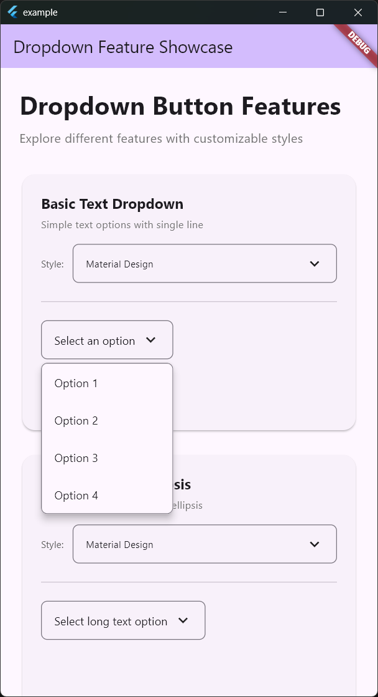
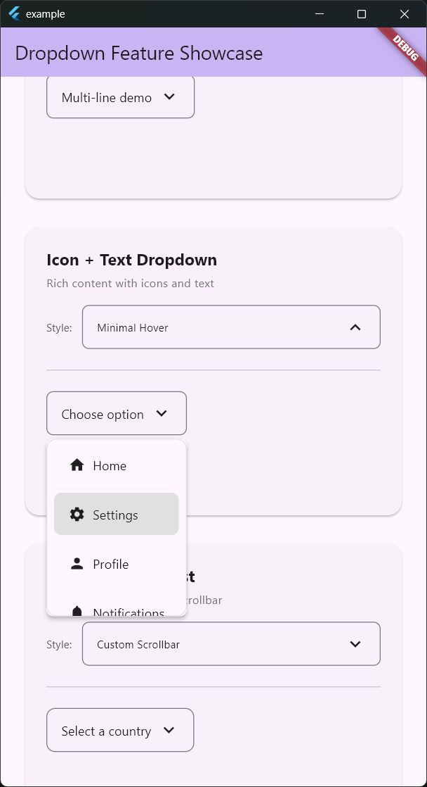

# Flutter Dropdown Button

A highly customizable dropdown package for Flutter with overlay-based rendering, smooth animations, and specialized variants for different content types.

[](https://pub.dev/packages/flutter_dropdown_button)
[](https://opensource.org/licenses/MIT)

## Features

- 🎨 **Highly Customizable**: Complete control over appearance and behavior
- 📱 **Overlay-based Rendering**: Better positioning and visual effects
- ✨ **Smooth Animations**: Scale and fade effects with configurable timing
- 🎯 **Outside-tap Dismissal**: Automatic closure when tapping outside
- 📏 **Dynamic Width**: Fixed, min/max width constraints, or content-based sizing
- 📐 **Independent Menu Width**: Set menu width separately from button with min/max constraints and alignment control
- 📝 **Text Overflow Control**: Ellipsis, fade, clip, or visible overflow options
- 🎭 **Multiple Variants**: Generic BasicDropdownButton and specialized TextOnlyDropdownButton
- 🎨 **Shared Theme System**: Consistent styling across all dropdown variants
- 📜 **Custom Scrollbar**: Scrollbar theming with colors, thickness, and visibility options
- 💬 **Smart Tooltip**: Automatic tooltip on overflow with full customization
- ♿ **Accessibility Support**: Screen reader friendly with proper semantics

## Screenshots

<table>
  <tr>
    <td></td>
    <td></td>
  </tr>
  <tr>
    <td align="center"><b>Basic Text Dropdown</b><br/>Simple text options with customizable styles</td>
    <td align="center"><b>Icon + Text Dropdown</b><br/>Rich content with icons and hover effects</td>
  </tr>
</table>

## Variants

| Variant | Description | Width |
|---------|-------------|-------|
| `BasicDropdownButton<T>` | Generic dropdown supporting any widget as items | Fixed, min/max, or content-based |
| `TextOnlyDropdownButton` | Text-only dropdown with fixed width | **Required** fixed `width` |
| `DynamicTextBaseDropdownButton` | Text dropdown with dynamic width and single-item mode | Content-based with min/max constraints |

## Quick Start

Add to your `pubspec.yaml`:

```yaml
dependencies:
  flutter_dropdown_button: ^1.6.1
```

Import the package:

```dart
import 'package:flutter_dropdown_button/flutter_dropdown_button.dart';
```

## Basic Usage

### BasicDropdownButton

```dart
BasicDropdownButton<String>(
  items: [
    DropdownItem(
      value: 'apple',
      child: Row(
        children: [
          Icon(Icons.apple),
          SizedBox(width: 8),
          Text('Apple'),
        ],
      ),
      onTap: () => print('Apple selected!'),
    ),
    DropdownItem(
      value: 'banana',
      child: Text('Banana'),
    ),
  ],
  value: selectedValue,
  hint: Text('Select a fruit'),
  onChanged: (value) {
    setState(() => selectedValue = value);
  },
)
```

### TextOnlyDropdownButton

```dart
TextOnlyDropdownButton(
  items: ['Short', 'Medium length text', 'Very long text that overflows'],
  value: selectedText,
  hint: 'Select an option',
  width: 200,
  config: TextDropdownConfig(
    overflow: TextOverflow.ellipsis,
    maxLines: 1,
  ),
  onChanged: (value) {
    setState(() => selectedText = value);
  },
)
```

### DynamicTextBaseDropdownButton

```dart
DynamicTextBaseDropdownButton(
  items: availableOptions,  // Adapts behavior based on item count
  value: selectedValue,
  hint: 'Select an option',
  minWidth: 120,
  maxWidth: 300,
  leading: Icon(Icons.star, size: 20),
  selectedLeading: Icon(Icons.star, size: 20, color: Colors.blue),
  config: TextDropdownConfig(
    overflow: TextOverflow.ellipsis,
    maxLines: 1,
  ),
  onChanged: (value) {
    setState(() => selectedValue = value);
  },
)
```

---

## API Reference

### BasicDropdownButton\<T\>

Generic dropdown supporting any widget as items.

| Parameter | Type | Default | Description |
|-----------|------|---------|-------------|
| **`items`** | `List<DropdownItem<T>>` | **required** | List of items to display |
| **`onChanged`** | `ValueChanged<T?>` | **required** | Called when an item is selected |
| `value` | `T?` | `null` | Currently selected value |
| `hint` | `Widget?` | `null` | Widget shown when no item is selected |
| `borderRadius` | `double` | `8.0` | Border radius for button and overlay |
| `decoration` | `BoxDecoration?` | `null` | Custom decoration for overlay |
| `width` | `double?` | `null` | Fixed width of button |
| `minWidth` | `double?` | `null` | Minimum width constraint |
| `maxWidth` | `double?` | `null` | Maximum width constraint |
| `height` | `double` | `200.0` | Maximum height of dropdown overlay |
| `itemHeight` | `double` | `48.0` | Height of each dropdown item |
| `animationDuration` | `Duration` | `200ms` | Duration of show/hide animation |
| `enabled` | `bool` | `true` | Whether the dropdown is interactive |
| `expand` | `bool` | `false` | Expand to fill available space in flex container |
| `trailing` | `Widget?` | `null` | Custom widget replacing default arrow icon |
| `scrollToSelectedItem` | `bool` | `true` | Auto-scroll to selected item on open |
| `scrollToSelectedDuration` | `Duration?` | `null` | Scroll animation duration (`null` = instant jump) |
| `showSeparator` | `bool` | `false` | Show separators between items (**deprecated**, use `DropdownTheme.itemBorder`) |
| `separator` | `Widget?` | `null` | Custom separator widget (**deprecated**) |
| `minMenuWidth` | `double?` | `null` | Minimum width of dropdown menu |
| `maxMenuWidth` | `double?` | `null` | Maximum width of dropdown menu |
| `menuAlignment` | `MenuAlignment` | `.left` | Menu alignment when wider than button |
| `theme` | `DropdownStyleTheme?` | `null` | Theme configuration |

### TextOnlyDropdownButton

Text-only dropdown with **required fixed width**.

| Parameter | Type | Default | Description |
|-----------|------|---------|-------------|
| **`items`** | `List<String>` | **required** | List of text options |
| **`onChanged`** | `ValueChanged<String?>` | **required** | Called when an item is selected |
| **`width`** | `double` | **required** | Fixed width of dropdown |
| `value` | `String?` | `null` | Currently selected value |
| `hint` | `String?` | `null` | Text shown when no item is selected |
| `config` | `TextDropdownConfig?` | `null` | Text rendering configuration |
| `height` | `double` | `200.0` | Maximum height of dropdown overlay |
| `itemHeight` | `double` | `48.0` | Height of each dropdown item |
| `animationDuration` | `Duration` | `200ms` | Duration of show/hide animation |
| `enabled` | `bool` | `true` | Whether the dropdown is interactive |
| `trailing` | `Widget?` | `null` | Custom widget replacing default arrow icon |
| `scrollToSelectedItem` | `bool` | `true` | Auto-scroll to selected item on open |
| `scrollToSelectedDuration` | `Duration?` | `null` | Scroll animation duration (`null` = instant jump) |
| `showSeparator` | `bool` | `false` | **Deprecated**: use `DropdownTheme.itemBorder` |
| `separator` | `Widget?` | `null` | **Deprecated**: use `DropdownTheme.itemBorder` |
| `minMenuWidth` | `double?` | `null` | Minimum width of dropdown menu |
| `maxMenuWidth` | `double?` | `null` | Maximum width of dropdown menu |
| `menuAlignment` | `MenuAlignment` | `.left` | Menu alignment when wider than button |
| `theme` | `DropdownStyleTheme?` | `null` | Theme configuration |

### DynamicTextBaseDropdownButton

Text dropdown with **content-based dynamic width** and automatic single-item mode.

When `disableWhenSingleItem` is `true` and the list has only one item, the widget becomes a non-interactive display (no dropdown arrow, auto-selects the only item).

| Parameter | Type | Default | Description |
|-----------|------|---------|-------------|
| **`items`** | `List<String>` | **required** | List of text options |
| **`onChanged`** | `ValueChanged<String?>` | **required** | Called when an item is selected |
| `value` | `String?` | `null` | Currently selected value |
| `hint` | `String?` | `null` | Text shown when no item is selected |
| `config` | `TextDropdownConfig?` | `null` | Text rendering configuration |
| `minWidth` | `double?` | `null` | Minimum width constraint |
| `maxWidth` | `double?` | `null` | Maximum width constraint |
| `height` | `double` | `200.0` | Maximum height of dropdown overlay |
| `itemHeight` | `double` | `48.0` | Height of each dropdown item |
| `animationDuration` | `Duration` | `200ms` | Duration of show/hide animation |
| `enabled` | `bool` | `true` | Whether the dropdown is interactive |
| `expand` | `bool` | `false` | Expand to fill available space in flex container |
| `trailing` | `Widget?` | `null` | Custom widget replacing default arrow icon |
| `disableWhenSingleItem` | `bool` | `true` | Disable dropdown when only one item exists |
| `hideIconWhenSingleItem` | `bool` | `true` | Hide arrow icon in single-item mode |
| `leading` | `Widget?` | `null` | Widget displayed before text in all items |
| `selectedLeading` | `Widget?` | `null` | Widget displayed before text in selected item only |
| `leadingPadding` | `EdgeInsets?` | `EdgeInsets.only(right: 8.0)` | Padding around the leading widget |
| `scrollToSelectedItem` | `bool` | `true` | Auto-scroll to selected item on open |
| `scrollToSelectedDuration` | `Duration?` | `null` | Scroll animation duration (`null` = instant jump) |
| `minMenuWidth` | `double?` | `null` | Minimum width of dropdown menu |
| `maxMenuWidth` | `double?` | `null` | Maximum width of dropdown menu |
| `menuAlignment` | `MenuAlignment` | `.left` | Menu alignment when wider than button |
| `theme` | `DropdownStyleTheme?` | `null` | Theme configuration |

### DropdownItem\<T\>

Item model for `BasicDropdownButton`.

| Parameter | Type | Default | Description |
|-----------|------|---------|-------------|
| **`value`** | `T` | **required** | The value for this item (should be unique) |
| **`child`** | `Widget` | **required** | Widget to display for this item |
| `onTap` | `VoidCallback?` | `null` | Additional callback when item is selected |

### MenuAlignment

Alignment of the dropdown menu relative to the button when the menu is wider.

| Value | Description |
|-------|-------------|
| `MenuAlignment.left` | Left edges align, menu extends right **(default)** |
| `MenuAlignment.center` | Menu centered over button |
| `MenuAlignment.right` | Right edges align, menu extends left |

---

## Theme System

Theme is applied via the `theme` parameter using `DropdownStyleTheme`, which groups three theme objects:

```dart
DropdownStyleTheme(
  dropdown: DropdownTheme(...),   // General dropdown styling
  scroll: DropdownScrollTheme(...), // Scrollbar styling
  tooltip: DropdownTooltipTheme(...), // Tooltip styling
)
```

### DropdownTheme

Controls general styling for button, overlay, and items.

#### Button Styling

| Parameter | Type | Default | Description |
|-----------|------|---------|-------------|
| `buttonDecoration` | `BoxDecoration?` | `null` | Custom button decoration (overrides all below) |
| `buttonPadding` | `EdgeInsets` | `horizontal: 16, vertical: 12` | Internal padding of button |
| `buttonHeight` | `double?` | `null` | Height of button content area (falls back to `iconSize` or `24.0`) |
| `buttonHoverColor` | `Color?` | `null` | Button hover background color |
| `buttonSplashColor` | `Color?` | `null` | Button tap ripple color |
| `buttonHighlightColor` | `Color?` | `null` | Button focus highlight color |

#### Overlay Styling

| Parameter | Type | Default | Description |
|-----------|------|---------|-------------|
| `overlayDecoration` | `BoxDecoration?` | `null` | Custom overlay decoration (overrides `backgroundColor`, `border`, `borderRadius`) |
| `overlayPadding` | `EdgeInsets?` | `null` | Padding inside the overlay container |
| `borderRadius` | `double` | `8.0` | Border radius for button and overlay |
| `elevation` | `double` | `8.0` | Shadow depth of overlay |
| `backgroundColor` | `Color?` | `null` | Overlay background color (falls back to `Theme.cardColor`) |
| `border` | `Border?` | `null` | Border for button and overlay (falls back to `Theme.dividerColor`) |
| `shadowColor` | `Color?` | `null` | Overlay shadow color |
| `animationDuration` | `Duration` | `200ms` | Animation duration |

#### Item Styling

| Parameter | Type | Default | Description |
|-----------|------|---------|-------------|
| `itemPadding` | `EdgeInsets` | `horizontal: 16, vertical: 12` | Internal padding of each item |
| `itemMargin` | `EdgeInsets?` | `null` | External margin around each item |
| `itemBorderRadius` | `double?` | `null` | Border radius for individual items |
| `itemBorder` | `Border?` | `null` | Border for each item (e.g., bottom divider) |
| `excludeLastItemBorder` | `bool` | `true` | Skip `itemBorder` on the last item |
| `selectedItemColor` | `Color?` | `null` | Background color for selected item (falls back to `primaryColor` 10%) |
| `itemHoverColor` | `Color?` | `null` | Item hover background color |
| `itemSplashColor` | `Color?` | `null` | Item tap ripple color |
| `itemHighlightColor` | `Color?` | `null` | Item focus highlight color |

#### Icon Styling

| Parameter | Type | Default | Description |
|-----------|------|---------|-------------|
| `icon` | `IconData?` | `Icons.keyboard_arrow_down` | Dropdown arrow icon |
| `iconSize` | `double?` | `24.0` | Size of the dropdown icon |
| `iconColor` | `Color?` | `null` | Icon color when enabled |
| `iconDisabledColor` | `Color?` | `null` | Icon color when disabled |
| `iconPadding` | `EdgeInsets?` | `EdgeInsets.only(left: 8.0)` | Padding around the icon |

### DropdownScrollTheme

Controls scrollbar appearance inside the dropdown overlay.

| Parameter | Type | Default | Description |
|-----------|------|---------|-------------|
| `thickness` | `double?` | `null` | Unified scrollbar thickness (**deprecated**: use `thumbWidth`/`trackWidth`) |
| `thumbWidth` | `double?` | `null` | Width of the scrollbar thumb |
| `trackWidth` | `double?` | `null` | Width of the scrollbar track |
| `radius` | `Radius?` | `null` | Corner radius of scrollbar thumb |
| `thumbColor` | `Color?` | `null` | Color of the scrollbar thumb |
| `trackColor` | `Color?` | `null` | Color of the scrollbar track |
| `trackBorderColor` | `Color?` | `null` | Border color of the scrollbar track |
| `alwaysVisible` | `bool?` | `null` | Always show scrollbar |
| `thumbVisibility` | `bool?` | `null` | Show/hide scrollbar thumb |
| `trackVisibility` | `bool?` | `null` | Show/hide scrollbar track |
| `interactive` | `bool?` | `null` | Allow dragging the scrollbar thumb |
| `crossAxisMargin` | `double?` | `null` | Margin from edge of scroll view |
| `mainAxisMargin` | `double?` | `null` | Margin at top/bottom of scrollbar |
| `minThumbLength` | `double?` | `null` | Minimum length of scrollbar thumb |
| `showScrollGradient` | `bool?` | `false` | Show fade gradient when scrollable |
| `gradientHeight` | `double?` | `24.0` | Height of gradient effect |
| `gradientColors` | `List<Color>?` | `null` | Custom gradient colors (auto-detects from background if `null`) |

### DropdownTooltipTheme

Controls tooltip styling and behavior for text-based dropdowns. Tooltips appear when text overflows.

#### Visual Styling

| Parameter | Type | Default | Description |
|-----------|------|---------|-------------|
| `decoration` | `Decoration?` | `null` | Custom tooltip decoration (overrides individual style properties below) |
| `backgroundColor` | `Color?` | `null` | Tooltip background color |
| `textColor` | `Color?` | `null` | Tooltip text color (ignored if `textStyle` is set) |
| `textStyle` | `TextStyle?` | `null` | Tooltip text style (overrides `textColor`) |
| `borderRadius` | `BorderRadius?` | `null` | Tooltip corner radius |
| `borderColor` | `Color?` | `null` | Tooltip border color |
| `borderWidth` | `double?` | `1.0` | Tooltip border width (only if `borderColor` is set) |
| `shadow` | `List<BoxShadow>?` | `null` | Tooltip shadow |
| `padding` | `EdgeInsetsGeometry?` | `null` | Padding inside tooltip |
| `margin` | `EdgeInsetsGeometry?` | `null` | Margin around tooltip |
| `constraints` | `BoxConstraints?` | `null` | Min/max width/height constraints |
| `textAlign` | `TextAlign?` | `null` | Tooltip text alignment |

#### Behavior

| Parameter | Type | Default | Description |
|-----------|------|---------|-------------|
| `enabled` | `bool` | `true` | Enable/disable tooltip |
| `mode` | `TooltipMode` | `.onlyWhenOverflow` | When to show tooltip (see below) |
| `waitDuration` | `Duration` | `500ms` | Delay before showing on hover |
| `showDuration` | `Duration` | `3s` | How long tooltip stays visible |
| `exitDuration` | `Duration` | `100ms` | Fade-out duration |
| `verticalOffset` | `double?` | `null` | Gap between widget and tooltip |
| `preferBelow` | `bool?` | `null` | Force tooltip below (`null` = auto-calculate) |
| `enableTapToDismiss` | `bool?` | `true` | Dismiss tooltip by tapping it |
| `triggerMode` | `TooltipTriggerMode?` | `null` | How tooltip is triggered (hover/long-press/tap) |

#### TooltipMode

| Value | Description |
|-------|-------------|
| `TooltipMode.onlyWhenOverflow` | Show only when text is clipped **(default, recommended)** |
| `TooltipMode.always` | Always show on hover/long-press |
| `TooltipMode.disabled` | Never show tooltips |

### TextDropdownConfig

Configuration for text rendering in `TextOnlyDropdownButton` and `DynamicTextBaseDropdownButton`.

| Parameter | Type | Default | Description |
|-----------|------|---------|-------------|
| `overflow` | `TextOverflow` | `.ellipsis` | How to handle text overflow (`ellipsis`, `fade`, `clip`, `visible`) |
| `maxLines` | `int?` | `1` | Maximum number of lines (`null` = unlimited) |
| `textStyle` | `TextStyle?` | `null` | Style for item text |
| `hintStyle` | `TextStyle?` | `null` | Style for hint text |
| `selectedTextStyle` | `TextStyle?` | `null` | Style for selected item text (falls back to `textStyle`) |
| `textAlign` | `TextAlign` | `.start` | Horizontal text alignment |
| `softWrap` | `bool` | `true` | Allow line breaks at word boundaries |
| `textDirection` | `TextDirection?` | `null` | Text direction (LTR/RTL) |
| `locale` | `Locale?` | `null` | Locale for text rendering |
| `textScaler` | `TextScaler?` | `null` | Text scaling for accessibility |
| `semanticsLabel` | `String?` | `null` | Semantic label for screen readers |

**Built-in presets:**

| Preset | Description |
|--------|-------------|
| `TextDropdownConfig.defaultConfig` | Single-line with ellipsis |
| `TextDropdownConfig.multiLine` | Unlimited lines, visible overflow, soft wrap |
| `TextDropdownConfig.centered` | Center-aligned, single-line with ellipsis |
| `TextDropdownConfig.fadeOverflow` | Single-line with fade overflow |

---

## Advanced Features

### Custom Theme

```dart
TextOnlyDropdownButton(
  // ... other properties
  theme: DropdownStyleTheme(
    dropdown: DropdownTheme(
      borderRadius: 12.0,
      elevation: 4.0,
      backgroundColor: Colors.white,
      selectedItemColor: Colors.blue.withOpacity(0.1),
      itemHoverColor: Colors.grey.withOpacity(0.1),
      buttonDecoration: BoxDecoration(
        border: Border.all(color: Colors.blue),
        borderRadius: BorderRadius.circular(12),
      ),
      itemBorder: Border(bottom: BorderSide(color: Colors.grey.shade300, width: 1)),
      itemMargin: EdgeInsets.symmetric(horizontal: 4),
      itemBorderRadius: 8.0,
      overlayPadding: EdgeInsets.symmetric(vertical: 4),
    ),
    scroll: DropdownScrollTheme(
      thumbWidth: 6.0,
      trackWidth: 10.0,
      thumbColor: Colors.blue,
      trackColor: Colors.grey.withOpacity(0.2),
      trackVisibility: true,
      interactive: true,
      showScrollGradient: true,
      gradientHeight: 20.0,
    ),
    tooltip: DropdownTooltipTheme(
      backgroundColor: Colors.black87,
      textStyle: TextStyle(color: Colors.white, fontSize: 14),
      borderRadius: BorderRadius.circular(8),
      padding: EdgeInsets.symmetric(horizontal: 12, vertical: 8),
      mode: TooltipMode.onlyWhenOverflow,
      waitDuration: Duration(milliseconds: 300),
    ),
  ),
)
```

### Menu Width & Alignment

```dart
TextOnlyDropdownButton(
  // ... other properties
  width: 120,              // Button width
  minMenuWidth: 250,       // Menu minimum width (wider than button)
  maxMenuWidth: 400,       // Menu maximum width
  menuAlignment: MenuAlignment.center,  // left (default), center, or right
)
```

### Scroll to Selected Item

```dart
TextOnlyDropdownButton(
  // ... other properties
  scrollToSelectedItem: true,                     // Enable (default)
  scrollToSelectedDuration: Duration(milliseconds: 300),  // Animate (null = instant jump)
)
```

### Expand in Flex Container

```dart
Row(
  children: [
    Text('Label:'),
    BasicDropdownButton<String>(
      expand: true,   // Takes remaining space in Row
      maxWidth: 200,
      // ...
    ),
  ],
)
```

### Custom Trailing Icon

```dart
TextOnlyDropdownButton(
  trailing: Icon(Icons.expand_more, color: Colors.blue),
  // ...
)
```

### Single-Item Mode (DynamicTextBaseDropdownButton)

```dart
DynamicTextBaseDropdownButton(
  items: ['Only Option'],            // Single item
  disableWhenSingleItem: true,       // Becomes non-interactive (default)
  hideIconWhenSingleItem: true,      // Hides arrow icon (default)
  // ...
)
```

### Leading Widget (DynamicTextBaseDropdownButton)

```dart
DynamicTextBaseDropdownButton(
  items: ['USD', 'EUR', 'JPY'],
  leading: Icon(Icons.attach_money, size: 20),
  selectedLeading: Icon(Icons.attach_money, size: 20, color: Colors.blue),
  leadingPadding: EdgeInsets.only(right: 12),
  // ...
)
```

### Manual Dropdown Cleanup

```dart
// Close dropdown before navigation
void navigateToHome() {
  DropdownMixin.closeAll();
  Navigator.pushNamedAndRemoveUntil(context, '/home', (route) => false);
}
```

**Note**: Dropdowns are automatically cleaned up during widget disposal. Use `closeAll()` only when you need explicit control.

---

## Documentation

For detailed documentation and advanced usage examples, see:

- [Complete API Reference](documentation/api_reference.md)
- [Theming Guide](documentation/theming.md)
- [Text Configuration Guide](documentation/text_configuration.md)
- [Migration from DropdownButton](documentation/migration.md)

## Example

Check out the [example app](example/) for a comprehensive demonstration of all features and customization options.

## Contributing

Contributions are welcome! Please read our [Contributing Guide](CONTRIBUTING.md) for details on our code of conduct and the process for submitting pull requests.

## License

This project is licensed under the MIT License - see the [LICENSE](LICENSE) file for details.

## Changelog

See [CHANGELOG.md](CHANGELOG.md) for a detailed list of changes and version history.
